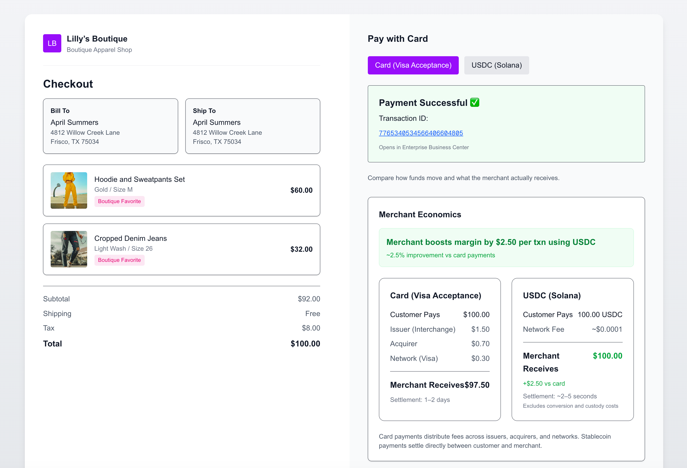

## ⚡ TL;DR

A working checkout that compares:

- Visa card payments (Flex Microform v2)
- USDC payments on Solana

Same transaction → different economics and settlement behavior

👉 Built to explore what happens when checkout itself moves onchain

# Checkout: Card Rails vs Onchain Payments (Visa Acceptance vs USDC on Solana)

Most discussions about stablecoins in payments focus on settlement.

In a recent announcement, Visa highlighted that partner banks like Cross River and Lead Bank are already settling transactions in USDC on Solana.

That raises a bigger question:

👉 What happens if you don’t just change settlement… but move checkout itself onchain?

This project explores that question through a working demo.

Same merchant. Same $100 order.

Two payment methods:
- Traditional card rails (Visa Acceptance)
- USDC on Solana (wallet-based payment)

## 🎥 Demo

▶️ LinkedIn Demo: https://www.linkedin.com/posts/praveenvemulapalli_payments-fintech-stablecoins-ugcPost-7451296387222376448-ZAFL

## 📰 Reference

Visa stablecoin settlement discussion:
https://x.com/SolanaFloor/status/2044717731766050905

---

## 🎯 Why I built this

Recent discussions around stablecoins in payments focus on settlement between institutions.

I wanted to explore what happens if the checkout experience itself becomes onchain.

This project is a hands-on attempt to bridge that gap.

---

## 🖼 Checkout Experience

> Side-by-side experience comparing card payments (Visa Acceptance) and USDC (Solana)

---

## 💡 What this shows

Sample Merchant and $100 Order

### Card Payments (Visa Acceptance)
- Merchant receives: ~$97.50
- Settlement: 1–2 days
- Fees distributed across issuer, acquirer, and network

### USDC (Solana)
- Merchant receives: ~$100.00
- Settlement: ~2–5 seconds
- Direct wallet-to-merchant transfer

---

## 🧠 Key Insight

This isn’t about replacing cards.

It’s about what changes when:
- settlement becomes programmable
- value moves natively on the internet

---

## 🏗 Architecture

### Frontend
- Next.js (App Router)
- Dual checkout experience (Card + USDC)
- Real-time balance and transaction feedback

### Card Processing (Visa Acceptance)

This project uses **Visa Acceptance Solutions – Flex Microform v2**:

- Secure card data capture using hosted iframes
- PCI DSS SAQ-A compliance (card data never touches frontend servers)
- Tokenization via transient tokens
- Backend authorization using Visa Acceptance APIs

👉 This mirrors real-world enterprise card integrations.

---

### Stablecoin Payments (Solana)

- USDC on Solana (Devnet)
- Wallet-based checkout using Solana Wallet Adapter
- SPL Token Program for transfers
- Near-instant settlement (~2–5 seconds)

---

## ⚖️ Why this comparison matters

Card payments:
- Multi-party system (issuer, acquirer, network)
- Higher fees (interchange + processing)
- Delayed settlement

Stablecoins:
- Direct value transfer
- Minimal network fees
- Faster settlement

Unlike card payments, stablecoin payments bypass intermediaries and settle directly between wallets, removing traditional fee layers.

---

## 📌 Project Structure

- `/frontend` → Checkout UI (Next.js)
- `/backend` → Payment APIs (Visa Acceptance)

---

## ⚠️ Disclaimer

This is a demo project using sandbox and devnet environments.  
No real funds or production systems are used.
💡 Tip: If you only want to test card payments, no wallet setup is required.

---

## 🚀 Why this matters

As stablecoins move from experimentation to real settlement rails, the implications for merchant economics and payment infrastructure are significant.

---

## 🪙 Running the USDC Flow (Optional)

To test the stablecoin checkout experience, you’ll need a Solana wallet and test USDC.

---

### 1. Install a wallet

Install a Solana-compatible wallet such as Phantom:
https://phantom.app/

---

### 2. Create two wallets

- **Shopper wallet** → used to make the payment  
- **Merchant wallet** → receives USDC  

Set the merchant wallet address in your frontend environment:
NEXT_PUBLIC_MERCHANT_WALLET=YOUR_MERCHANT_WALLET_ADDRESS

---

### 3. Fund your wallets (Devnet)

You will need both SOL (for gas fees) and USDC (for the payment).

#### Get Devnet SOL:
https://faucet.solana.com/

Request an airdrop to your shopper wallet.

#### Get Devnet USDC:
https://faucet.circle.com/

Fund your shopper wallet with test USDC.

---

### 4. Run the app
npm install
npm run dev

Open:
http://localhost:3000/checkout

---

### 5. Complete a USDC payment

- Connect your shopper wallet  
- Ensure sufficient USDC balance  
- Click **Pay with USDC**  
- Approve the transaction in your wallet  

---

## ⚠️ Limitations

- Uses sandbox (Visa) and devnet (Solana)
- Does not include refunds, disputes, or reconciliation flows
- Stablecoin UX still requires wallet setup (not consumer-friendly yet)

---

### ⚠️ Notes

- Uses **Solana Devnet (not real funds)**
- Network fees are minimal (~$0.0001)
- You may need to refresh balances after funding